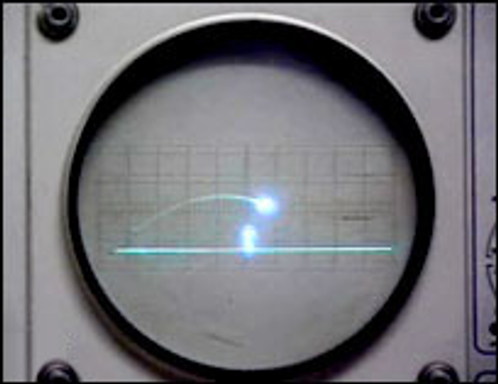

# Projeto Tennis For Two
## FPRO/MIEIC, 2020/21
## Henrique Oliveira Silva (up202007242)
## 1MIEIC07

### Objetivo

Criar um clone do clássico Tennis For Two em Pygame.

### Descrição

Tennis for Two (1958) é por vezes considerado como o primeiro jogo electrónico alguma vez criado. É um jogo de ténis bi-dimensional que usa física de projéteis para a dinâmica da bola. Cada jogador tem que lançar a bola para o outro lado sem bater na rede, nem sair fora do campo.

### UI

### Pacotes

- Pygame

### Tarefas

1. [ ] desenhar bola (pos\_x, pos\_y, vel\_x, vel\_y), mover para um dos lados usando equação de projecteis
1. [ ] ler teclas e modificar movimento da bola (vel\_x = -vel\_x)
1. [ ] criar barreira no centro; terminar jogo se bater na barreira ou sair
1. [ ] efeito visual do trilho da bola
1. [ ] adicionar um menu

### Código

    import pygame
    import time 
    pygame.init()

    # visuals
    white = (255, 255, 255)
    BALL_COLOR = (255, 255, 0)

    # screen
    screen_width = 600
    screen_height = 400
    screen = pygame.display.set_mode((screen_width, screen_height))
    pygame.display.set_caption("Tennis For Two")
    font = pygame.font.SysFont("arial", 32, bold = True)

    # time_issues
    t = time.perf_counter()

    #ball 
    ball_px = int(screen_width / 2)
    ball_py = int(screen_height / 2)
    ball_vx = 0.1
    ball_vy = 0.1
    ball_r = 8

    # bottom_line
    bot_x = 20
    bot_y = 380
    bot_w = 560
    bot_h = 10

    # net
    net_x = 295
    net_y = 290
    net_w = 10
    net_h = 100

    # initialize score
    player1_score = 0
    player2_score = 0

    # - colisao circulo
    # - colisao rectangulos (bounding box)
    # - colisao perfect pixel collision

    def collision(cx1, cy1, cw1, ch1, cx2, cy2, cw2, ch2):
        xxx

    # main game
    pygame.mouse.set_visible(1)
    pygame.key.set_repeat()
    game = True
    while game:
        # ciclo de eventos
        for event in pygame.event.get():
            if event.type == pygame.QUIT:
                game = False
        # ver se existe alguma tecla pressionada
        pressed = pygame.key.get_pressed()
        if pressed[pygame.K_ESCAPE]:
            game = False
        
        # logica
    
        # location of ball is updated
        ball_px += ball_vx
        ball_py += ball_vy
    
        # collision of ball with top/bottom of screen
        if ball_py - ball_r <= 0 or ball_py + ball_r >= screen_height - 19:
            ball_vy *= -1
    
        # player score
        hited_floor_1 = False
        hited_floor_2 = False
        if ball_py <= 0 and hited_floor_1 == False and ball_px < 295:
            hited_floor_1 = True
        elif ball_py <= 0 and hited_floor_2 == False and ball_px > 305:
            hited_floor_2 = True        
        if ball_px <= 0 and hited_floor_1 == True:
            player2_score += 1
            ball_px = int(screen_width / 2)
            ball_py = int(screen_height / 2)
        elif ball_px >= screen_width and hited_floor_2 == True:
            player1_score += 1
            ball_px = int(screen_width / 2)
            ball_py = int(screen_height / 2)
    
        # design
        screen.fill((0, 255, 0))
        pygame.draw.circle(screen, BALL_COLOR, (ball_px, ball_py), ball_r)
        pygame.draw.rect(screen, white, (bot_x, bot_y, bot_w, bot_h), 0)
        pygame.draw.rect(screen, white, (net_x, net_y, net_w, net_h), 0)
        pygame.display.flip()

    pygame.quit()
